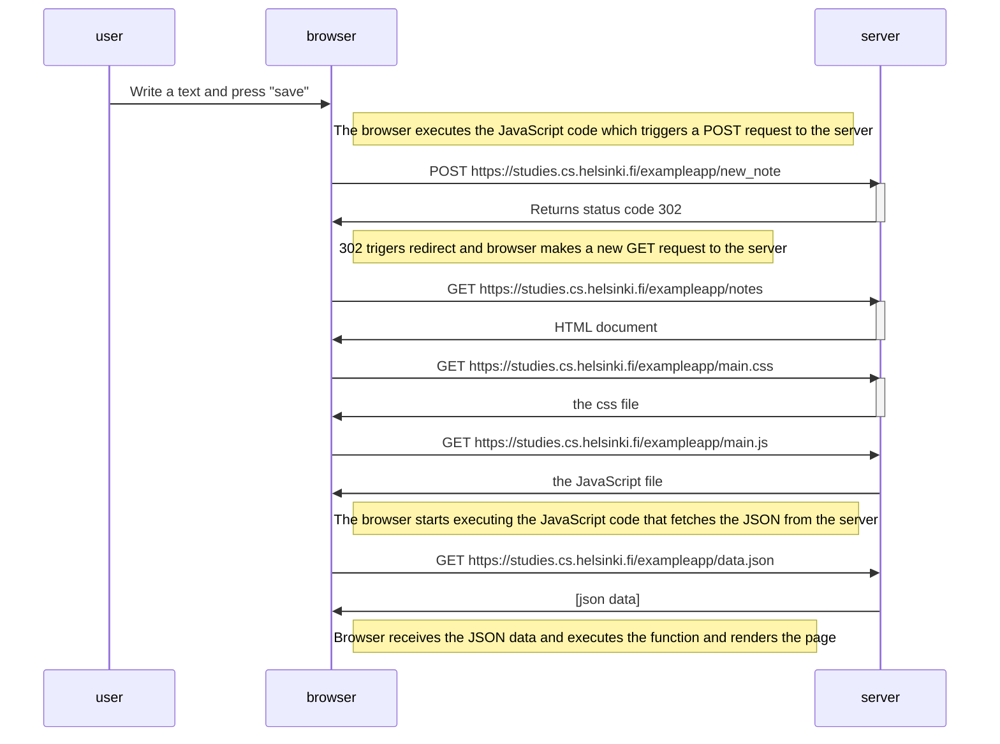

```mermaid
    sequenceDiagram
    participant user
    participant browser
    participant server

    user->>browser: Write a text and press "save"
    Note right of browser: The browser executes the JavaScript code which triggers a POST request to the server
    browser->>server: POST https://studies.cs.helsinki.fi/exampleapp/new_note
    activate server
    server->>browser: Returns status code 302
    deactivate server

    Note right of browser: 302 trigers redirect and browser makes a new GET request to  the server
    browser->>server: GET https://studies.cs.helsinki.fi/exampleapp/notes
    activate server
    server->>browser: HTML document
    deactivate server

    browser->>server: GET https://studies.cs.helsinki.fi/exampleapp/main.css
    activate server
    server->>browser: the css file
    deactivate server

    browser->>server: GET https://studies.cs.helsinki.fi/exampleapp/main.js
    server->>browser: the JavaScript file
    Note right of browser: The browser starts executing the JavaScript code that fetches the JSON from the server

    browser->>server: GET https://studies.cs.helsinki.fi/exampleapp/data.json
    server->>browser: [json data]
    Note right of browser: Browser receives the JSON data and executes the function and renders the page
```
