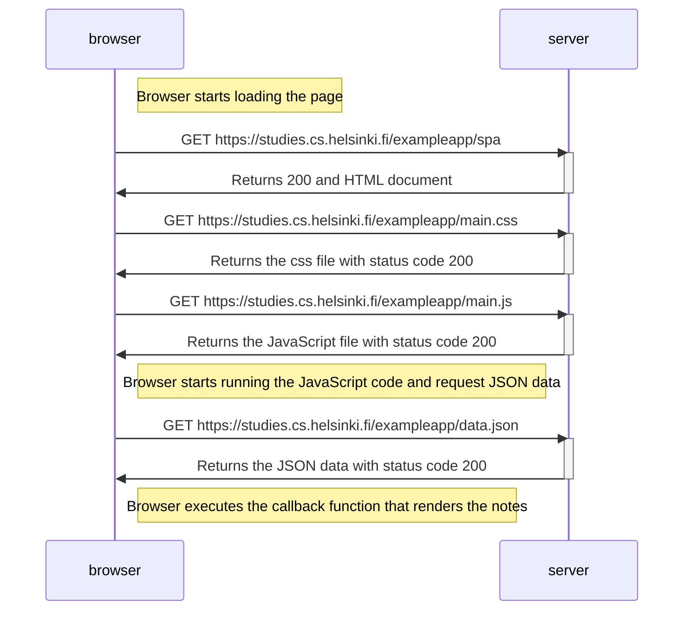

```mermaid
    sequenceDiagram
    participant browser
    participant server

    
    Note right of browser: Browser starts loading the page
    browser->>server: GET https://studies.cs.helsinki.fi/exampleapp/spa
    activate server
    server->>browser: Returns 200 and HTML document
    deactivate server

    browser->>server: GET https://studies.cs.helsinki.fi/exampleapp/main.css
    activate server
    server->>browser: Returns the css file with status code 200
    deactivate server

    browser->>server: GET https://studies.cs.helsinki.fi/exampleapp/main.js
    activate server
    server->>browser: Returns the JavaScript file with status code 200
    deactivate server

    Note right of browser: Browser starts running the JavaScript code and request JSON data

    browser->>server: GET https://studies.cs.helsinki.fi/exampleapp/data.json
    activate server
    server->>browser: Returns the JSON data with status code 200
    deactivate server 

    Note right of browser: Browser executes the callback function that renders the notes

```
