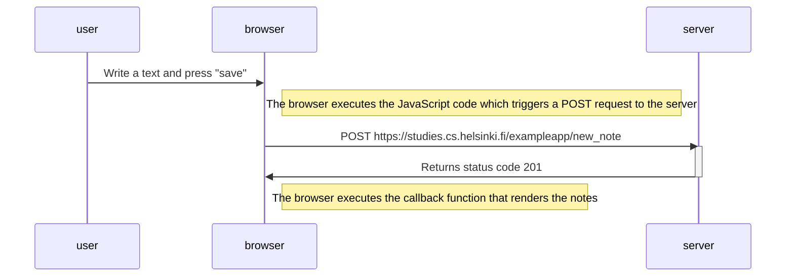

```mermaid
    sequenceDiagram
    participant user
    participant browser
    participant server

    user->>browser: Write a text and press "save"
    Note right of browser: The browser executes the JavaScript code which triggers a POST request to the server
    browser->>server: POST https://studies.cs.helsinki.fi/exampleapp/new_note
    activate server
    server->>browser: Returns status code 201
    deactivate server

    Note right of browser: The browser executes the callback function that renders the notes

```